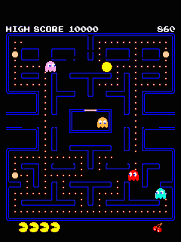

  

## Project Overview

As a final project in the Artificial Intelligence course at Stanford Univerity's Precollegiate Studies, my team and I created the most optimal Pacman and ghost agents (after much trial and error). The details of the implementations can be found below. This project was completed in collaboration with Ziz Cheng and Charles Sun.

After the completion of this project, I have also implemented various other Pacman agents with several approaches, including:
* Iterative Deepening
* Multi-agent
* Alpha-beta pruning
* Minimax and Expectimax
* SAT Solver and logic
* Graph planning
* Linear Programming and Integer Programming
* Branch-and-Bound
* MDPs and Value Iteration
* Q-learning
* Bayes' Nets
* Joint Particle Filter

These files are not contained in this Github repository, but feel free to reach out for more info on the other implementations.

## Implementation Details

### Pac-Man Behavior
	
Our Pacman uses the A* algorithm and path-finds to the closest food. During A*, the heuristic cost function is described as follows:
* Cost of pellet: 1
* Cost of empty grid: 5
* Cost of Moore neighbors around ghost: 50
* Cost of Von Neumann neighbors around ghost: 99

Note that the cost of Von Neumann neighbors override the cost of Moore neighbors - the square directly in front of a ghost (and not diagonal) will have a cost of 99. These costs ensure that the Pac-Man, in its quest for vengeance, does not run into the ghosts and prioritizes food over empty squares. When a ghost is scared, the heuristics are modified and Pac-Man will path-find to the scared ghost instead of food.

### Ghosts Behavior

We deduced that the optimal strategy for the ghosts was to surround a single pellet and prevent it from being eaten so that Pac-Man could never finish the game. However, once we started writing the code for the ghosts, we realized that the ghosts were not allowed to turn around or stop in place, so those ideas were scrapped. Instead, we used A* and provided 4 different ghost behaviors:
1. Follows Pac-Man and prefers to approach from behind (By setting the move cost in front of Pac-Man to be higher)
2. Follows Pac-Man and prefers to approach from ahead (Which allows trapping behavior)
3. Follows Pac-Man (No preference).
4. Choose a random location on the board and path finds to it, but, set the moveCost (gCost) to a location to be the squared distance between the location and the Pac-Man’s location. This means the ghost would prefer to choose a path that leads it closer to Pac-Man.

When the ghosts are in scared mode (after Pacman eats a power pellet), they run away to the location furthest away from Pac-Man.
